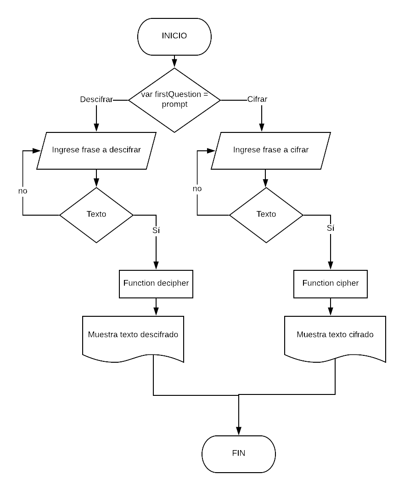

# CIFRADO CÉSAR

### Descripción:

Se crea una web que pida una frase de un usuario y devuelva esta misma frase encriptada según el algoritmo de “Cifrado César”,  se deben de cumplir las siguientes condiciones iniciales: el usuario debe ingresar una frase que no sea número y el usuario no podrá ingresar un campo vacío, la web brinda las opciones de ‘cifrar una frase’ o ‘descifrar’.  El código está compuesto por dos funciones, una de cifrado (cipher) y otra de descifrado (decipher).

Otras consideraciones: se realiza un parámetro de desplazamiento de 33 espacios a la derecha,  el cifrado reconoce mayúsculas y minúsculas.

## Pseudocódigo
### Descripción

1. Se tiene variable llamada firstQuestion que por medio de un prompt pregunta al usuario si quiere cifrar o descifrar una  frase.

2. Si el usuario selecciona la opción de cifrar una frase se pide por medio de un prompt con el nombre de la variable  enterPhrase  el texto a cifrar o de lo contrario el texto a descifrar.

3. Se establece que solo se ingrese texto, no números ni espacio vacío, si es así vuelve a preguntar que se ingrese la frase a cifrar hasta que sea introducido el texto.

4. Se desarrollan las funciones cipher para cifrar el texto y decipher para descifrarlo respectivamente.  

5. Se  muestra el texto que se introdujo en la variable enterPhrase cifrado o descifrado según sea el caso.

## Diagrama de flujo

